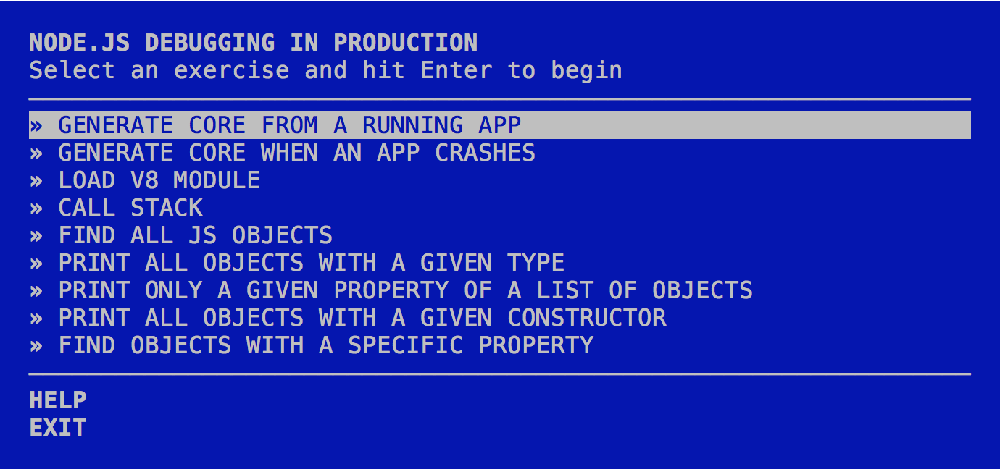

# Node.js Debug School

This workshop teaches students the concept and tools needed to debug Node.js
applications in production and post-mortem on SmartOS. It is presented as a
series of short hands-on exercises.



## Prerequisites

### SmartOS

__You will need an access to a SmartOS instance to run this workshop.__

The reason for such a requirement is that SmartOS _currently_ provides the
best experience for postmortem debugging of Node.js applications. Later, you
will be able to run this workshop on other platforms. For instance, TJ
Fontaine has been working on [v8 support for
lldb](https://github.com/tjfontaine/lldb-v8), which should help porting this
workshop to any platform where lldb is available.

To get access to a SmartOS instance, there are three different options:
* Signing up for an account on Joyent's Public Cloud.
* Installing SmartOS on your machine within a VMWare VM.
* If you're attending a workshop, using one of the VMs that the workshop's
organizer has reserved for workshop attendees.

#### Signing up for an account on Joyent's Public Cloud

The quickest way to install `node-debug-school` is to [sign up for an account
on Joyent's Public
Cloud](https://my.joyent.com/landing/signup/701800000015N22) and use the free
services tier. Your credit card number will be required, but you won't be
billed if you use only the free tier. You can also cancel your subscription at
any time.

#### Installing SmartOS on your machine with VMWare

Installing SmartOS on your machine with VMWare takes longer, but it allows you
to experiment a bit more with this great operating system.

First, you will need to install [VMWare
Workstation](http://www.vmware.com/ca/en/products/workstation) or [VMWare
Fusion](http://www.vmware.com/ca/en/products/fusion/features.html) if you're
using a Mac.

Then, download the [official SmartOS VM for VMWare](http://bit.ly/smartosvm).
Now, you can [open the SmartOS VM you just downloaded with
VMWare](https://wiki.smartos.org/display/DOC/SmartOS+as+a+VMware+Guest).

Finally, follow the [instructions to create a zone within the VMWare guest](ht
tps://wiki.smartos.org/display/DOC/How+to+create+a+zone+%28+OS+virtualized+mac
hine+%29+in+SmartOS). However, instead of choosing the `base` or `base64`
images, choose the most recent `nodejs` image. Here's how to find the image UUID for this image:
```
# imgadm avail | grep nodejs | tail -1 | cut -f 1 -d ''

```

Depending on your host OS, you will also need to tweak the `nics` section of
the zone manifest, otherwise you won't be able to access any network from the
SmartOS zone.

## How to start the workshop?

Simply install node-debug-school globally (you will need root access to do that):
```
$ npm install -g node-debug-school
```
and start `node-debug-school`:
```
$ node-debug-school
```

You will be presented with a series of exercises, each containing instructions
on how to complete them.

### Running the workshop on SmartOS as non-root

When starting the workshop as a non-root user on SmartOS, you will get the
following error message:

```
Running the workshop as a non-root user requires
per process core dumps enabled. See man coreadm for
more info on how to do that, or point your browser to
https://github.com/joyent/node-debug-school for help.
```

This means that you need to enable per-process core dumps _as root_ first
before switching back to your user and run the workshop.

To enable per-process core dumps, simply enter the following command line _as
root_:
```
$ coreadm -e process
```

Switch back to your user, and you should be able to run the workshop.

If you don't have root access to the machine on which you're running the
workshop and if you see this error message, you won't be able to run the
workshop.

### Command line options

#### --dev

`--dev` is for _development mode_.

Use `--dev` if you'd like to run the workshop without checking if you're using
a supported platform. This is useful when developping or testing the workshop
on an unsupported platform.

### Supported platforms

Currently, the only supported platform is SmartOS, because mdb and mdb's v8
module are needed to complete most exercises. However, if you'd like to run
the workshop on an unsupported platform, you can still use the `--dev` command
line switch. It will bypass any platform check. Keep in mind however that some
parts of the workshop might not work correctly.
